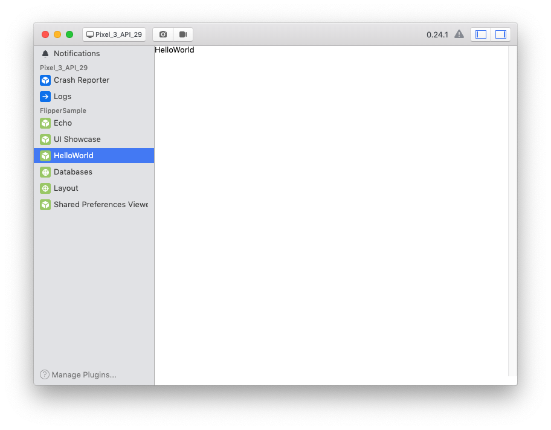

# Flipper Plugin 샘플

## 프로젝트 개요
[Flipper](https://www.fbflipper.com) 의 커스텀 플러그인 샘플 프로젝트이다. 


## 구조

프로젝트 구조는 다음과 같다.

* /sample_app : 샘플 안드로이드 앱. 커스텀 플러그인을 탑재했을 뿐, 아무 기능이 없다.
* /flipper_plugin : 샘플 커스텀 플러그인들. 각 하위 디렉터리에 작성된 플러그인은 다음과 같다
  * /helloworld : 그냥 HelloWorld 만 출력한다.
  * /echo : 앱에 메시지 요청을 보내고, 앱이 보낸 메시지를 출력한다.
  * /uishowcase : 기본 제공하는 다양한 UI component 사용 방법을 보여준다.

## 설정

1. 프로젝트를 적절한 곳에 clone 한다.
1. [Flipper 홈페이지](https://fbflipper.com/)에서 데스크탑 클라이언트를 다운받아 설치한 후, 실행한다.
2. 클라이언트를 종료한 후, 맥 기준으로 `~/.flipper/config.json` 파일을 열고, `pluginPath` 에 clone 한 프로젝트의 `flipper_plugin` 경로를 추가한다.<br/>예) 
   ```json
   {
       "pluginPaths":["~/workspace/flipper_plugin_example/flipper_plugin/"],
       ...
   }
   ```
3. 다시 클라이언트를 실행한 후, 샘플 앱을 빌드하여 실행한다.

실행을 하면 다음 그림과 같이 좌측 플러그인 리스트에 커스텀 플러그인이 표시된다.

